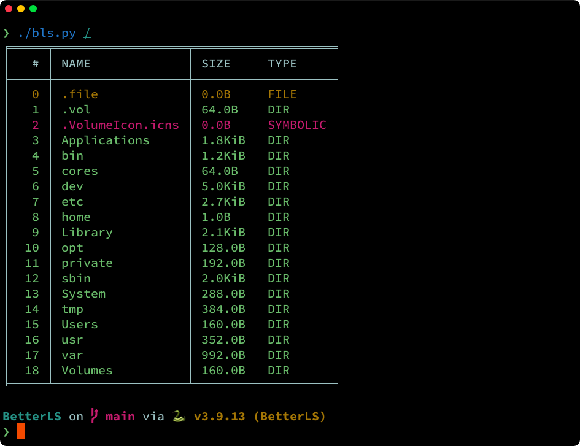

<h2 align="center"> ━━━━━━  ❖  ━━━━━━ </h2>

<!-- BADGES -->
<div align="center">
   <p></p>
   <a href="">
      
   </a>
   <a href="https://github.com/iamtinsae/BetterLS/stargazers">
      
   </a>
   <a href="https://github.com/iamtinsae/BetterLS/">
      
   </a>
   <br>
</div>
<div align="center">
   <p></p>
</div>

<p/>

<h2></h2>

<!-- INFORMATION -->
## :herb: <samp>INFORMATION</samp> 
A better `ls` alternative for everyone.
### :warning: <samp>Incomplete and work in progress.</samp>

   

   The [setup section](#-setup) will guide you through a step-by-step installation process.


<!-- SETUP -->
## :wrench: <samp>SETUP</samp>

   This is step-by-step how to install and use `bls`. 
   <br />
   > Make sure you have python3 installed!
   ```sh
    > git clone https://github.com/iamtinsae/BetterLS.git
    > cd BetterLS && chmod +x ./bls.py
    > ./bls.py /
   ```

<p align="center">
   
</p>
